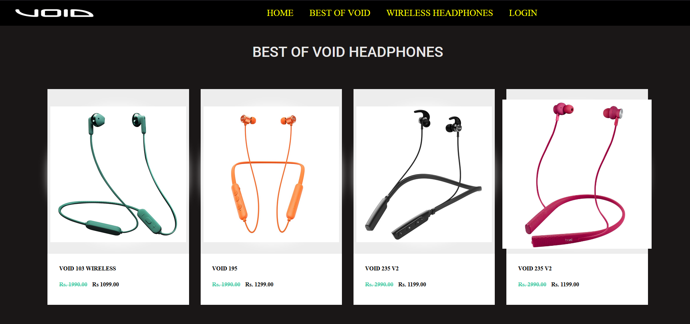
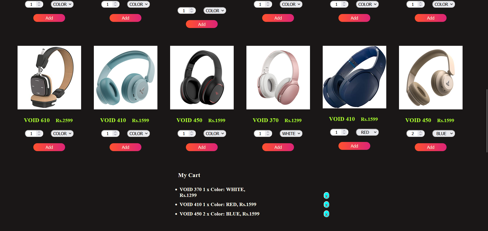
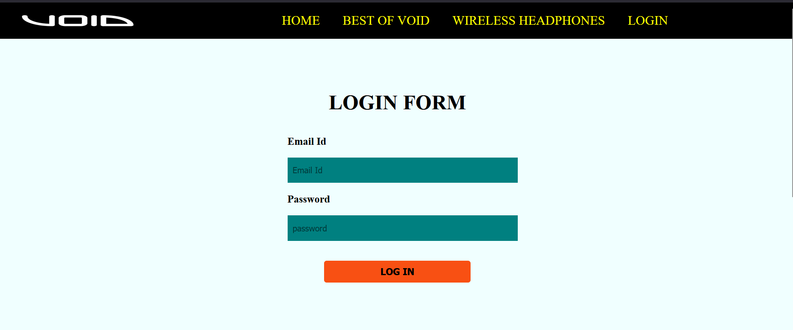

Let me know how you're uploading — I can guide step-by-step if needed.
You said:
void earphone sstatic website 
where you hav ehome page
secon is a pg where shoe whic are the best one
thirs pag is where ther RE EARPHONES WITH PROCE AND COLOUR ASLO CRAT IT ADDS AND LOGIN PG
ChatGPT said:

Got it! Here's a complete GitHub README.md tailored for your Void Earphones static website project that includes home
# Void Earphones 🎧

A responsive static website for **Void Earphones**, showcasing premium earphones with product listings, price details, and shopping cart simulation.  
Built using **HTML**, **CSS**, and **JavaScript**.

---

## 📷 Project Screenshot

---

## 🚀 Features

- Multi-page responsive website.
- Pages included:
   - **Home Page** (`index.html`)
   - **Best Earphones Page** (showcasing top picks)
   - **Products Page** (with price, color, and product details)
   - **Cart Page** (simulated cart functionality)
   - **Login Page**
- Simple and clean UI focused on product display.

---

## 📁 Project Structure

void-earphones-website/
│
├── index.html # Home page
├── best-earphones.html # Best products showcase
├── products.html # Earphones with price & color
├── login.html # Login page
├── css/
│ └── style.css # Main stylesheet
├── images/
│ └── product_images.png # Earphones images
├── README.md
└── screenshots/
└── void_earphones_demo.png

---

## 📦 How to Run

1. Clone or download this repository.
2. Open `index.html` in any web browser.
3. Navigate between pages using the website’s navbar or buttons.

---

## 📎 Developed By

**[Aasmi Jugari](https://github.com/AasmiJugari)**

